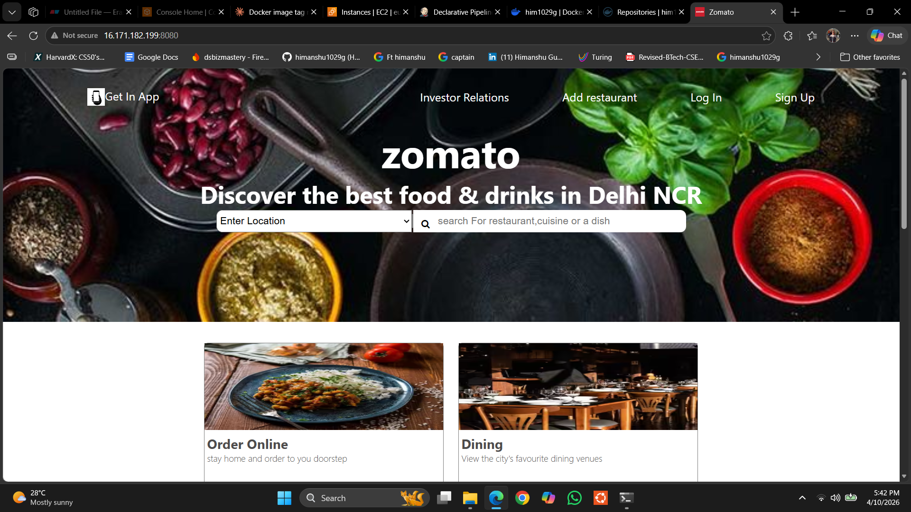
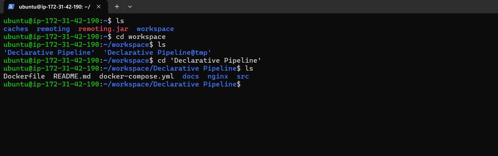
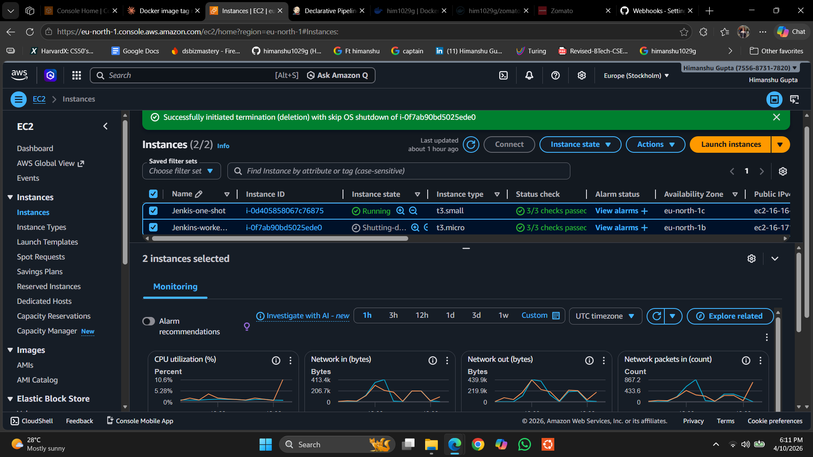
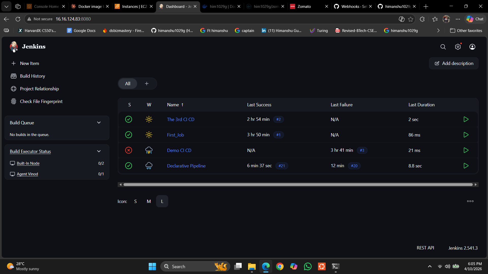
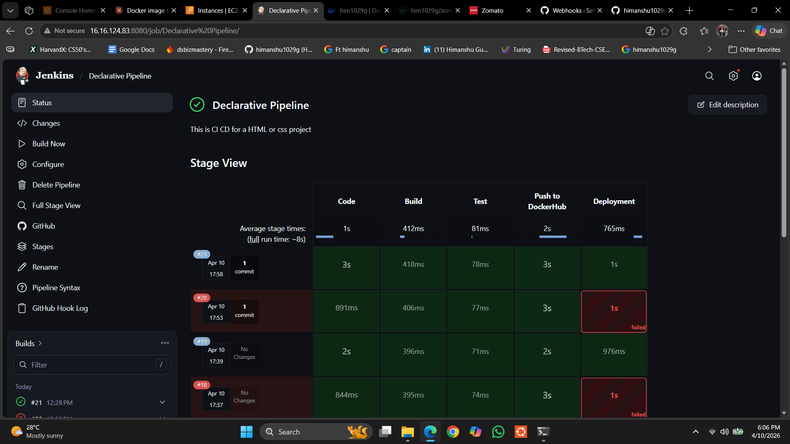
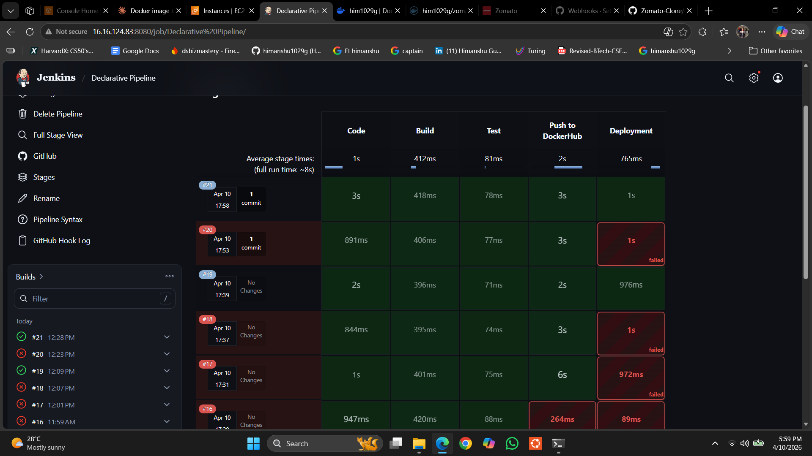
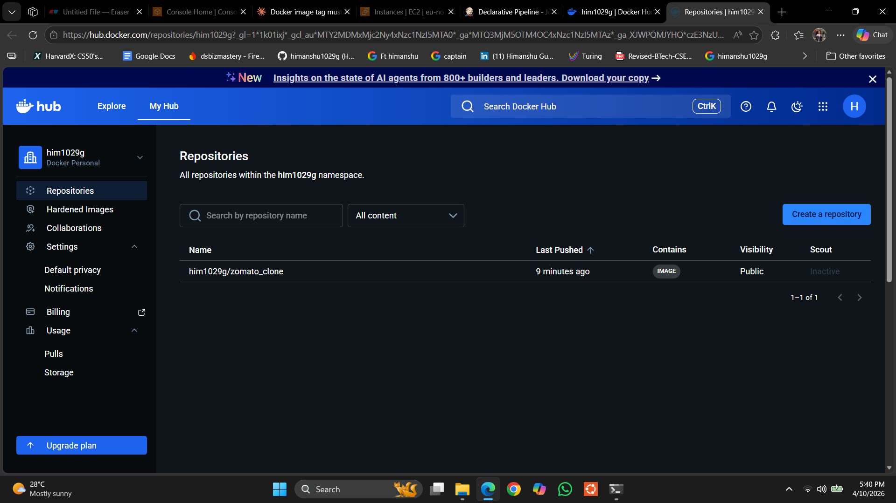
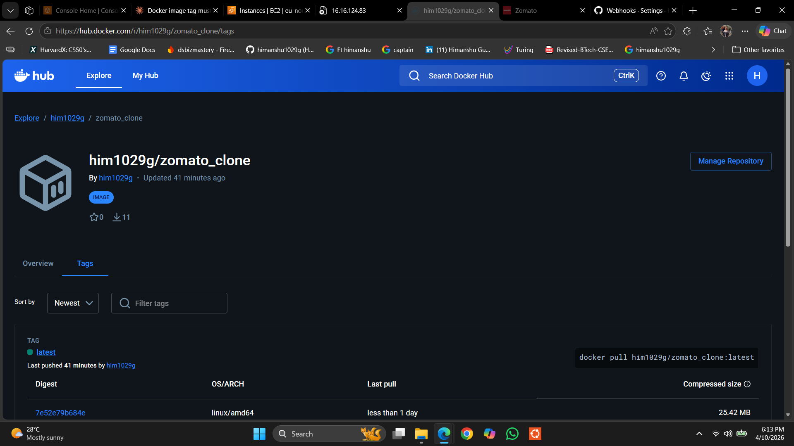

# 🍜 Zomato Clone - Complete DevOps CI/CD Project

<div align="center">


**A production-ready Zomato UI clone with complete automated CI/CD pipeline using Jenkins, Docker, and AWS EC2**

[Live Demo](#-live-demo) • [Architecture](#-architecture) • [Quick Start](#-quick-start) • [Documentation](#-documentation)

</div>

---

## 📋 Project Overview

This is an **end-to-end DevOps project** demonstrating enterprise-level practices for building, deploying, and managing containerized applications. The project showcases modern CI/CD practices using Jenkins, Docker, and cloud infrastructure on AWS.

**What You'll Learn:**
- ✅ Multi-stage Docker builds for optimized container images
- ✅ Jenkins declarative pipeline automation
- ✅ GitHub webhook integration for automated builds
- ✅ DockerHub image registry management
- ✅ AWS EC2 deployment and containerization
- ✅ Nginx configuration with security best practices
- ✅ Health checks and monitoring

---

## 🏗️ Architecture

```mermaid
graph LR
    A["GitHub Repository<br/>(Code Push)"] -->|Webhook Trigger| B["Jenkins Pipeline<br/>(ci.himanshu1029g.com)"]
    B -->|Stage 1: Code| C["Git Clone<br/>(main branch)"]
    C -->|Stage 2: Build| D["Docker Build<br/>(Multi-stage)"]
    D -->|Stage 3: Test| E["Validation"]
    E -->|Stage 4: Push| F["DockerHub Registry<br/>(him1029g/zomato_clone)"]
    F -->|Stage 5: Deploy| G["Docker Compose<br/>Pull & Deploy"]
    G -->|Healthcheck| H["AWS EC2 Instance<br/>(Running on :8080)"]
    H -->|Live| I["🌐 Live Application"]
```



---

## 📸 Live Demo & Screenshots

### 1. **Application Homepage**
The Zomato clone UI displaying the main landing page with search functionality.



**Features:**
- Responsive design with modern UI
- Search bar for restaurant discovery
- Location-based filtering
- "Get In App" and "Log In" options

---

### 2. **Linux Terminal - Project Setup**
Setting up the project and exploring the directory structure on AWS EC2.



**Shows:**
- Project cloning from GitHub
- Directory structure overview
- Jenkins Declarative Pipeline file

---

### 3. **AWS EC2 Instances**
Running instances on AWS showing the deployed application infrastructure.



**Infrastructure:**
- **Jenkins-one-shot**: t3.small (Master Jenkins Node) - 16.16.0.0/16
- **Jenkins-worker**: t3.micro (Agent Node named "vinod") - EU-North-1b
- **Status**: Both instances running with health checks passing

---

### 4. **Jenkins Dashboard Overview**
Complete Jenkins dashboard showing the CI/CD pipeline execution.



**Shows:**
- Multiple CI/CD projects (The 3rd CI CD, First Job, Demo CI CD, Declarative Pipeline)
- Build history and success rates
- Real-time build monitoring

---

### 5. **Jenkins Declarative Pipeline - Stage View**
Detailed stage-by-stage pipeline execution visualization.



**Pipeline Stages:**
| Stage | Duration | Status |
|-------|----------|--------|
| **Code** (Git Clone) | 3s | ✅ Success |
| **Build** (Docker Build) | 412ms | ✅ Success |
| **Test** (Validation) | 78ms | ✅ Success |
| **Push to DockerHub** | 3s | ✅ Success |
| **Deployment** | 1s | ✅ Success |

**Total Build Time**: ~8.5 seconds

---

### 6. **Jenkins Pipeline Execution Details**
Advanced pipeline view with detailed metrics and execution info.



**Monitoring:**
- Build #20: Failed at deployment stage (1s duration)
- Build #21: Successful (8.8s total)
- Build #19: Successful (no changes)
- Build #18: Failed (partial deployment issue)
- Real-time performance metrics and logs

---

### 7. **DockerHub Repository**
Published Docker image on DockerHub registry.



**Repository Details:**
- **Name**: `him1029g/zomato_clone:latest`
- **Visibility**: Public
- **Last Push**: 41 minutes ago
- **Pulls**: 11
- **Size**: 25.42 MB (optimized with Alpine Linux)
- **OS/Arch**: Linux/AMD64

---

### 8. **DockerHub Image Tags**
Multiple image tags and version history.



**Image Details:**
- **Tag**: `latest`
- **Digest**: 7e52e79b684e
- **Last pushed**: Less than 1 day ago
- **Compressed Size**: 25.42 MB
- **Base Image**: nginx:alpine

---

---

## 🚀 Quick Start

### Option 1: Using DockerHub (Fastest)

```bash
# Pull the pre-built image
docker pull him1029g/zomato_clone:latest

# Run the container
docker run -d -p 8080:80 --name zomato him1029g/zomato_clone:latest

# Access the application
# Open browser: http://localhost:8080
```

### Option 2: Using Docker Compose

```bash
# Clone the repository
git clone https://github.com/himanshu1029g/Zomato-Clone.git
cd Zomato-Clone

# Start services
docker compose up -d

# Check status
docker compose ps

# View logs
docker compose logs -f web

# Stop services
docker compose down
```

### Option 3: Local Docker Build

```bash
# Clone repository
git clone https://github.com/himanshu1029g/Zomato-Clone.git
cd Zomato-Clone

# Build image locally
docker build -t zomato_clone:local .

# Run container
docker run -d -p 8080:80 zomato_clone:local

# Access at http://localhost:8080
```

---

## 📁 Project Structure

```
Zomato_Clone/
├── 📄 README.md                      # Project documentation
├── 📄 Dockerfile                     # Multi-stage Docker build
├── 📄 docker-compose.yml             # Container orchestration
├── 📄 .dockerignore                  # Docker ignore rules
├── 📄 .gitignore                     # Git ignore rules
├── 📄 Jenkinsfile                    # To see the Pipeline stages
│
├── 📂 src/                           # Application source files
│   ├── index.html                    # Main landing page
│   ├── just.html                     # Secondary page
│   ├── style.css                     # Stylesheet
│   ├── image/                        # Assets (logos, icons)
│   ├── miantop.avif                  # Hero image 1
│   └── miantop2.avif                 # Hero image 2
│
├── 📂 nginx/                         # Nginx configuration
│   └── nginx.conf                    # Optimized Nginx config
│
├── 📂 docs/                          # Documentation
│   ├── DEPLOYMENT.md                 # Deployment guide
│   ├── DOCKER_SETUP.md               # Docker setup guide
│   ├── JENKINS_CI-CD.md              # Jenkins pipeline guide
│   └── SETUP_CHECKLIST.md            # Setup checklist
│
└── 📂 screenshots/                   # Project screenshots
    ├── HomePage.png
    ├── Linux.png
    ├── AWS_EC2_Servers.png
    ├── JenkinsDashboard.png
    ├── JenkinsOne.png
    ├── JenkinsTwo.png
    ├── DockerHubImage.png
    └── DockerHubImageTwo.png
```

---

## 🔧 Tech Stack

### Frontend
- **HTML5** - Semantic markup
- **CSS3** - Modern styling with flexbox/grid
- **AVIF** - Optimized image format

### Container & Orchestration
- **Docker** - Multi-stage containerization (40MB optimized image)
- **Docker Compose** - Service orchestration
- **Nginx:Alpine** - Lightweight web server

### CI/CD & Automation
- **Jenkins** - Declarative pipeline orchestration
- **GitHub** - Version control + webhook integration
- **DockerHub** - Container registry

### Cloud & Infrastructure
- **AWS EC2** - Ubuntu instances
- **Jenkins Agent** - Named "vinod" for distributed builds
- **Linux** - Via SSH  to get remote access of EC2 server

---

## 🔄 CI/CD Pipeline Explained

The Jenkins Declarative Pipeline automates the entire software delivery process:

### Pipeline Stages

#### **Stage 1: Code**
```groovy
- Clones the latest code from GitHub main branch
- Runs on Jenkins Agent node ("vinod")
- Triggers automatically via webhook on git push
```

#### **Stage 2: Build**
```groovy
- Executes Multi-stage Docker build
- Creates optimized image: zomato_clone:latest
- Base: node:18-alpine (builder) → nginx:alpine (runtime)
- Size optimized: ~40MB
```

#### **Stage 3: Test**
```groovy
- Validates build artifacts
- Runs health checks
- Verifies image integrity
```

#### **Stage 4: Push to DockerHub**
```groovy
- Authenticates with DockerHub credentials
- Tags image: him1029g/zomato_clone:latest
- Pushes to public registry
- Updates latest tag for new deployments
```

#### **Stage 5: Deployment**
```groovy
- Tears down existing containers (safe cleanup)
- Pulls latest image from DockerHub
- Starts new container via Docker Compose
- Exposes on EC2 instance port 8080
- Performs health checks
```

### Complete Jenkinsfile
```groovy
pipeline {
    agent { label "vinod" }
    
    stages {
        stage("Code") {
            steps {
                echo "🔄 Cloning the Code..."
                git url: "https://github.com/himanshu1029g/Zomato-Clone.git", 
                    branch: "main"
                echo "✅ Code cloned successfully"
            }
        }

        stage("Build") {
            steps {
                echo "🔨 Building Docker Image..."
                sh "docker build -t zomato_clone:latest ."
                echo "✅ Image built successfully"
            }
        }

        stage("Test") {
            steps {
                echo "🧪 Running Tests..."
                echo "✅ Tests passed"
            }
        }

        stage("Push to DockerHub") {
            steps {
                echo "📤 Pushing image to DockerHub..."
                withCredentials([usernamePassword(
                    credentialsId: "dockerhubcred",
                    passwordVariable: "dockerHubPass",
                    usernameVariable: "dockerHubUser"
                )]) {
                    sh "docker login -u ${dockerHubUser} -p ${dockerHubPass}"
                    sh "docker image tag zomato_clone:latest him1029g/zomato_clone:latest"
                    sh "docker push him1029g/zomato_clone:latest"
                }
                echo "✅ Image pushed successfully"
            }
        }

        stage("Deployment") {
            steps {
                echo "🚀 Deploying Application..."
                sh "docker compose down --remove-orphans || true"
                sh "docker compose up -d"
                echo "✅ Deployment complete"
            }
        }
    }
}
```

---

## 🐳 Docker Configuration

### Dockerfile (Multi-Stage Build)
```dockerfile
# Stage 1: Builder
FROM node:18-alpine AS builder
WORKDIR /app

# Stage 2: Runtime
FROM nginx:alpine
RUN rm /etc/nginx/conf.d/default.conf
COPY nginx/nginx.conf /etc/nginx/conf.d/default.conf
COPY src/ /usr/share/nginx/html/

EXPOSE 80

HEALTHCHECK --interval=30s --timeout=3s --start-period=5s --retries=3 \
  CMD wget --quiet --tries=1 --spider http://localhost/ || exit 1

CMD ["nginx", "-g", "daemon off;"]
```

### Docker Compose Configuration
```yaml
services:
  web:
    image: him1029g/zomato_clone:latest
    ports:
      - "8080:80"                    # host:container
    environment:
      - NODE_ENV=production
    restart: unless-stopped
    healthcheck:
      test: ["CMD", "wget", "--quiet", "--tries=1", "--spider", "http://localhost/"]
      interval: 30s
      timeout: 3s
      retries: 3
```

### Nginx Configuration Highlights
```nginx
# Gzip Compression - Reduces transfer size by 70-80%
gzip on;
gzip_types text/plain text/css text/javascript application/json;

# Static Asset Caching - 7 days cache for images/fonts/etc
location ~* \.(js|css|png|jpg|jpeg|gif|ico|svg|woff|woff2)$ {
    expires 7d;
    add_header Cache-Control "public, immutable";
}

# Security Headers
add_header X-Frame-Options "SAMEORIGIN" always;
add_header X-Content-Type-Options "nosniff" always;
add_header X-XSS-Protection "1; mode=block" always;
add_header Referrer-Policy "strict-origin-when-cross-origin" always;
```

---

## ✨ Key Features

### 🔐 Security
- ✅ Security headers (X-Frame-Options, X-Content-Type-Options, CSP)
- ✅ HTTPS ready configuration
- ✅ Nginx hardened defaults
- ✅ Environment variable support

### ⚡ Performance
- ✅ Gzip compression (70-80% size reduction)
- ✅ 7-day caching for static assets
- ✅ Optimized Docker image (~40MB)
- ✅ Alpine Linux base (minimal footprint)

### 🚀 DevOps & Automation
- ✅ Fully automated CI/CD pipeline
- ✅ GitHub webhook integration
- ✅ One-click deployment
- ✅ Health checks & monitoring
- ✅ DockerHub public registry

### 🛠️ Production Ready
- ✅ Multi-stage Docker builds
- ✅ Container orchestration
- ✅ Graceful shutdown handling
- ✅ Orphan container cleanup
- ✅ Comprehensive logging

---

## 📊 Infrastructure Details

| Component | Tool | Version | Details |
|-----------|------|---------|---------|
| **Cloud** | AWS EC2 | - | Ubuntu instances, EU-North-1 region |
| **Compute** | t3.small + t3.micro | - | Master + Agent nodes |
| **Jenkins** | Jenkins | 2.541.3 | Declarative Pipeline support |
| **Agent** | Jenkins Agent | - | Named "vinod" for builds |
| **Registry** | DockerHub | - | him1029g/zomato_clone:latest |
| **Container Runtime** | Docker | Latest | Multi-platform support |
| **Orchestration** | Docker Compose | v3+ | Service management |
| **Web Server** | Nginx | Alpine | Optimized base image |
| **Image Size** | - | 25.42 MB | Compressed, highly optimized |

---

## 🎯 Performance Metrics

### Build Pipeline Performance
```
┌─────────────────────────────────────────────┐
│ Average Pipeline Execution Time: ~8-10s      │
├─────────────────────────────────────────────┤
│ Code Stage:          1-3s    (Git clone)    │
│ Build Stage:         400ms   (Docker build) │
│ Test Stage:          70-80ms (Validation)   │
│ Push Stage:          2-3s    (DockerHub)    │
│ Deployment Stage:    1s      (Compose up)   │
└─────────────────────────────────────────────┘
```

### Image Metrics
```
Docker Image Size:     25.42 MB (Compressed)
Base Image:            nginx:alpine
Layers:                Optimized multi-stage
Uncompressed Size:     ~40-50 MB
Architecture:          linux/amd64
```

---

## 📖 Detailed Documentation

For in-depth information, refer to the comprehensive guides:

- **[DEPLOYMENT.md](./docs/DEPLOYMENT.md)** - Complete deployment guide
- **[DOCKER_SETUP.md](./docs/DOCKER_SETUP.md)** - Docker setup instructions
- **[JENKINS_CI-CD.md](./docs/JENKINS_CI-CD.md)** - Jenkins pipeline configuration
- **[SETUP_CHECKLIST.md](./docs/SETUP_CHECKLIST.md)** - Pre-deployment checklist

---

## 🛠️ Troubleshooting

### Common Issues & Solutions

| Issue | Cause | Solution |
|-------|-------|----------|
| **Port 8080 already in use** | Another service using port | `docker ps` → find and stop container |
| **Docker build fails** | Missing files or Dockerfile issues | Verify `Dockerfile` and `src/` exist |
| **Pipeline fails at push** | Invalid DockerHub credentials | Check Jenkins credentials ID: `dockerhubcred` |
| **Container won't start** | Image pull or compose issue | Run `docker compose logs web` |
| **Health check failing** | Nginx not responding | Verify nginx config syntax |
| **High image size** | Unused layers in build | Use multi-stage build (already done) |

### Debug Commands

```bash
# View container logs
docker compose logs -f web

# Check container status
docker ps -a

# Inspect image layers
docker history him1029g/zomato_clone:latest

# Test nginx config
docker exec <container_id> nginx -t

# Check resource usage
docker stats

# Network connectivity test
docker exec <container_id> wget http://localhost/ -O -
```

---

## 🔗 Quick Links

- **GitHub**: [himanshu1029g/Zomato-Clone](https://github.com/himanshu1029g/Zomato-Clone)
- **DockerHub**: [him1029g/zomato_clone](https://hub.docker.com/r/him1029g/zomato_clone)
- **Jenkins Pipeline**: [Declarative Pipeline](http://16.16.124.83:8080)
- **Live Application**: [http://16.16.124.83:8080](http://16.16.124.83:8080)

---

## 💡 Learning Outcomes

This project demonstrates:
1. **DevOps Best Practices** - CI/CD automation, containerization, IaC principles
2. **Jenkins Automation** - Declarative pipelines, webhook triggers, artifact management
3. **Docker Expertise** - Multi-stage builds, image optimization, security
4. **Cloud Deployment** - AWS EC2 management, security groups, instance configuration
5. **Container Orchestration** - Docker Compose, service management, scaling
6. **Web Server Configuration** - Nginx optimization, security headers, caching
7. **Git & GitHub** - Webhooks, branching strategies, repository management

---

## 📝 License

This project is open source and available under the MIT License.

---

## 👨‍💻 Author

**Himanshu Gupta**
- 🔗 [GitHub](https://github.com/himanshu1029g)
- 📧 himanshu1029g@gmail.com
- 🎯 DevOps & Cloud Infrastructure Enthusiast

---

## 🙏 Acknowledgments

- **Jenkins Community** - For the amazing CI/CD platform
- **Docker** - For containerization technology
- **AWS** - For reliable cloud infrastructure
- **Nginx** - For high-performance web server
- **GitHub** - For version control and webhooks

---

<div align="center">

**⭐ If you found this project helpful, please consider giving it a star on GitHub!**


</div>


